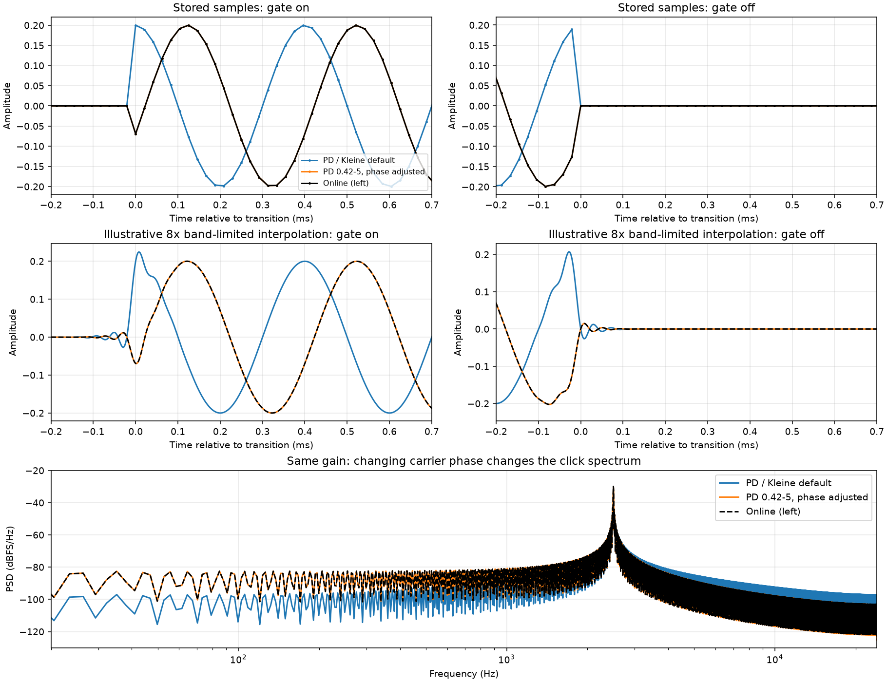

# Pedestrians listening review

**Sound review accepted.** Chris hears the phase-set PD 0.55 fixture as equivalent to the online recording. It uses an explicitly chosen initial phase, not a late snapshot from a drifting run. The waveform display observation is sufficiently explained for this review; further historical investigation is closed. Any block-timing workaround remains a separate decision.

## Current Klang implementation

Pedestrians now uses the reusable [pd::metro polling port](../../../tests/pd/metro.md), with `set(param on)`, `metro = on`, `if (metro(100))`, and `osc(2500) * gate * 0.2f >> out`. The member name `osc` maps directly to the patch's `osc~`. It preserves the patch's hardcoded values. The model contains no manual clock, block arithmetic, callback, `prepare()` override or extra parameter setter.

The retained 48 kHz default WAV remains sample-identical to PD. The stop/restart recipe also matches at 48 kHz and now starts explicitly stopped, without a hidden preliminary start. At 44.1 kHz, the requested sample-timed interpretation places edges 0–63 samples later than PD's block-advanced delivery; matching active carrier samples are identical. Sixteen primitive count/timing fixtures pass. PD block scheduling is deliberately deferred; raw 44.1 kHz parity is no longer claimed for these two model fixtures.

## Recording findings

The main difference from the online recording is **the carrier phase at the gate**, not overall gain. Both references hard-gate the sine wave. Matching phase in the original PD 0.42-5 executable reproduces the online recording to approximately its PCM16 noise floor, without adjusting gain, EQ or gate shape.

Chris's listening observation: tone/rhythm match, PD and Kleine sound practically identical, and the online transitions sound stronger. Chris also observed wavering around the PD/Kleine transitions in Audition. The measurements below explain a plausible mechanism; they are not an independent listening verdict or a verification of Audition's settings.

**Listening follow-up:** Chris reports that `review/pedestrians-phase-pd055.wav` perceptually has the same sound as `pedestrians-online.wav`. Thus the current PD oscillator already gives a perceptual match once its phase is adjusted; the original executable's smaller numerical residual is not an established audible advantage.

## Files and measured differences

The three existing listening files are unchanged. All are 48 kHz. PD/Kleine are four-second mono float32 bounces and are sample-identical. The online file is a 5.15-second stereo PCM16 excerpt, copied sample-for-sample from 0.05–5.2 seconds of `farnell/zip/p01/pedestrian-beeps.wav`.

| Measurement | PD / Kleine | Online |
| --- | ---: | ---: |
| Sample peak | 0.199999988 | 0.199981689 |
| First on-transition, sample index in retained file | 4800 | 5604 |
| First active sample | about +0.200 | about −0.069 |
| Carrier phase at first on-transition, cosine convention | almost 0° | about 249.72° |
| On duration / period | 4800 / 9600 samples | 4800 / 9600 samples |
| Quiet-region RMS, excluding 200 samples around gates | exactly zero | 0.00002642, or −91.56 dBFS |

The peaks differ by less than 0.001 dB. Whole-file RMS is affected by the different amounts of leading/trailing silence and is not a useful gain comparison here. Online quiet samples are 0, ±1 or ±2 PCM16 least-significant bits, with different tiny noise in each stereo channel. This is consistent with dither or export conversion; it does not establish the export software or exact processing chain.

### Does PD add output dither?

The built-in `soundfiler` and `writesf~` writers have **no dither option** in the inspected 0.42-5 and 0.55-2 sources. Both convert samples directly when writing integer PCM. Four executable checks (both writers in both releases) wrote over 40,000 samples of PCM16 silence with **zero nonzero samples**. [Results and source hashes](../../../../farnell/audio/comparisons/artificial/pedestrians-output.json) are reproducible with `python tools/check_pd_output.py`; normal scheduler operation allows the streaming writer's worker thread to finish.

The **PortAudio playback path is different**: both inspected releases open the stream with `paNoFlag`, leaving PortAudio's default conversion dithering enabled where an integer device format requires it. This is backend-dependent behaviour, not a dither checkbox on PD's WAV writer. A recording of that playback path, or a later export from an editor, is a plausible source of the online noise. It does not identify Andy's actual workflow. Sources: [PD file writer](https://github.com/pure-data/pure-data/blob/0.55-2/src/d_soundfile.c), [PD PortAudio backend](https://github.com/pure-data/pure-data/blob/0.55-2/src/s_audio_pa.c), and the original archive's `portaudio/include/portaudio.h` / `src/common/pa_converters.c` (`paDitherOff` and converter selection).

Dither could explain a tiny noise floor, but not the much larger, structured wavering around a gate. That remains explained by the transition phase and band-limited reconstruction shown below. Hardware capture was not tested.

Phase changes the transition spectrum even when pitch, timing and amplitude agree. On aligned 3.9-second passages, the online recording has **9.63 dB more power at 20–1000 Hz**, but **4.85 dB less at 5–20 kHz**. Thus the measured change is not a broad boost of both spectral ends. Analysis: Welch, Hann, FFT 16384, hop 1024, equal sample rate, no fitted gain.

## The wavering around transitions



The top row joins stored samples with straight lines: PD/Kleine switch directly between silence and the sine; there is no envelope ramp or modulation around the switch. The middle row reconstructs between those same samples using an illustrative band-limited interpolator. The larger step at the PD/Kleine gate produces more overshoot and ringing on both sides of the transition. Changing phase reproduces the online transition shape.

This is consistent with the wavering Chris sees in Audition. It does **not** establish Audition's specific drawing/resampling algorithm or settings. Ringing in a reconstructed curve can coexist with zero-valued stored samples; it is not evidence that the model fades or leaks during the off period. The illustration uses SciPy `resample_poly`, 8×, Kaiser beta 10; no such processing is applied to the retained WAVs.

### Resampling versus the waveform display

Chris confirmed that he is viewing the original WAVs directly in Audition's Waveform Editor, rather than clips in a multitrack session. Their stored sample rates are all 48 kHz, and the PD/Kleine samples immediately before the gate are exactly zero. This points to interpolation in the displayed curve, rather than stored pre-ringing. A band-limited reconstruction is meaningful signal reconstruction, not simply cosmetic smoothing; it can oscillate between zero-valued samples near a sharp step, and audio reconstruction filters can produce a similar effect. Audition's exact display algorithm remains unverified.

A separate [conversion experiment](../../../../farnell/audio/comparisons/artificial/pedestrians-resampling.png) confirms that actual 48→44.1 kHz resampling can also produce ringing, now present in the converted sample values. Using a zero-phase FIR converter, the default-phase signal's peak in the millisecond before the gate changes from exactly zero to 0.00284, or 0.00847 after conversion back to 48 kHz. These values depend on the chosen filter; this is not an emulation of Audition or a hardware driver. [Measurements and settings](../../../../farnell/audio/comparisons/artificial/pedestrians-resampling.json) are reproducible with:

```text
python tools/review_pedestrians.py --resampling-only --retain
```

PD normally computes DSP at its configured/negotiated sample rate, rather than always computing at 48 kHz and then converting to 44.1 kHz. These offline bounces explicitly use 48 kHz, without an audio device or sample-rate conversion. An operating-system/device playback path can convert rates independently, but that does not change the original WAV's stored samples. PD's `writesf~ -rate` option changes the file header rather than resampling the data. Sources: [PD's DSP scheduling documentation](https://msp.ucsd.edu/Pd_documentation/2.theory.of.operation.htm), [PortAudio rate negotiation](https://github.com/pure-data/pure-data/blob/0.55-2/src/s_audio_pa.c), and the installed `writesf~-help.pd`. The experimental converter follows [SciPy's documented polyphase filtering](https://docs.scipy.org/doc/scipy/reference/generated/scipy.signal.resample_poly.html).

## Historical executable and phase-only comparison

This review actually runs **PD 0.42-5**, reporting a May 7, 2009 compilation date, from [Miller Puckette's release archive](https://msp.ucsd.edu/Software/). It also runs installed PD 0.55.2 with compatibility 0.55 and 0.43. Compatibility mode is recorded separately from the original executable.

All renders use the website patch's 2500 Hz oscillator, 100 ms metro and 0.2 gain, with block size 64. Render copies expose the DAC output, add start/phase receivers and use the older `table` object for capture. The original patch is preserved. There are no filter or fade stages in its signal path. The original executable also produces exact zeros between beeps and the same nominal gain. Its smaller cosine table and numerical arithmetic cause fine differences, not a different gating law.

The fit estimates a carrier phase of **0.6936581973 cycles** from the first 20 online beeps, excluding 64 samples at each edge. Only that phase is applied to the PD trials. Estimated amplitude, DC and frequency are diagnostics and are not applied. Comparison aligns the first on-transition by an integer offset of 804 samples in the retained files; it does not align away the relative carrier phase.

| Phase-adjusted render | Error RMS versus online | Residual relative to signal |
| --- | ---: | ---: |
| PD 0.55.2, current oscillator | about 0.0000571 | about −65 dB |
| PD 0.55.2, compatibility 0.43 | about 0.0000567 | about −65 dB |
| Original PD 0.42-5 | **0.00002648** | **−71.65 dB** |

The original executable's error is approximately the online quiet noise floor, and its aligned level difference is only **+0.000134 dB**. This is strong evidence that phase plus historical oscillator arithmetic explains the recording without meaningful EQ or gain processing. It does not identify Andy's exact PD build, operating system, startup sequence or export settings.

For listening at unchanged gain:

- [Current PD, phase adjusted](../../../../farnell/audio/24-pedestrians/review/pedestrians-phase-pd055.wav)
- [Original PD 0.42-5, phase adjusted](../../../../farnell/audio/24-pedestrians/review/pedestrians-phase-pd042.wav)

These are diagnostic variants, not replacements for the default PD/Kleine fixtures.

## Does the phase drift during a long session?

Yes. Ideally 2500 Hz completes exactly 250 cycles per 100 ms gate interval, so relative phase stays fixed. Actual oscillator arithmetic introduces a tiny frequency error. The experiment continuously processes the original model for 1804.1 seconds of audio and captures four-second windows at the start, 13 minutes and 30 minutes. Batch processing advances the same DSP state faster than real time; it does not approximate the elapsed samples by jumping the phase.

| Executable | Phase drift at 13 minutes | Phase drift at 30 minutes |
| --- | ---: | ---: |
| Original PD 0.42-5 | −7.52° | −17.35° |
| Current PD 0.55.2 | −16.74° | −38.62° |

The metro keeps its 4800/9600-sample timing in all three capture windows. The measured carrier frequency errors are approximately −0.0000268 Hz and −0.0000596 Hz respectively. Over a short excerpt the phase is practically fixed; over many minutes it can noticeably change the shape and spectrum of the clicks. A recording taken at minute 13 can therefore differ from a freshly started bounce.

PD's application uptime alone is irrelevant. This particular oscillator must exist and have DSP running to advance its phase. In this patch it continues running while the metro is stopped: the multiplier silences its output, not the oscillator. Starting the metro later can therefore change the initial phase relationship too; control changes are constrained by PD's block scheduling. Starting a new oscillator after PD has merely been open for 30 minutes does not give that oscillator 30 minutes of history.

The online phase differs from our fresh-start phase by about −110.28° modulo one cycle. **The measured 13–30-minute drift alone is insufficient to explain that full offset from our initial state.** Other startup history or earlier control/sample-rate settings remain possible; the phase-only match does not prove any particular history. The 44.1 kHz trials also show block-quantised intervals and changing gate phase, unlike the recording's exact 48 kHz timing; changing sample rate is not needed to explain it.

## Evidence and reproduction

[Raw measurements and run records](../../../../farnell/audio/comparisons/artificial/pedestrians-review.json) contain source/executable/WAV hashes, version output, fitted values, integer alignment, controls, sample rate, block size, and CPU/RSS observations. Process CPU includes startup and I/O and is sampled as a lower bound; it is not an isolated DSP performance comparison. The original compiler is unknown. Generated render copies, logs and long-run capture WAVs remain under `build/pedestrians-review/`.

Obtain `pd-0.42-5.msw.zip` from the official archive above and extract it under `build/pedestrians-review/pd-0.42-5/`. The tested archive SHA-256 is `d071ab04d615de5c39921dd0e5a1d90885490bd5c0a656b561a5c844de9a14d2`.

```text
python tools/review_pedestrians.py --long-run --retain
```

Use `--old-pd` or `--pd` to supply executable paths. The script checks that the retained online excerpt preserves its original samples, PD/Kleine are sample-identical, the fresh current-PD render reproduces them, all rendered off periods are zero, and the long-run capture windows preserve gate timing. It does not download or install software. The retained 48 kHz default listening samples are unchanged by the later metro refactor.
